# 📋 DOCUMENTAÇÃO TÉCNICA - TOIT NEXUS

## 🏗️ Arquitetura do Sistema

### Visão Geral da Arquitetura

```
┌─────────────────┐    ┌─────────────────┐    ┌─────────────────┐
│   Frontend      │    │    Backend      │    │   Database      │
│   React 18      │◄──►│   Node.js       │◄──►│  PostgreSQL     │
│   JavaScript    │    │   Express       │    │   Supabase      │
└─────────────────┘    └─────────────────┘    └─────────────────┘
         │                       │                       │
         │              ┌─────────────────┐              │
         │              │     Redis       │              │
         └──────────────►│   Cache/Queue   │◄─────────────┘
                        └─────────────────┘
                                 │
                        ┌─────────────────┐
                        │ IBM Quantum     │
                        │ Network         │
                        └─────────────────┘
```

### Componentes Principais

#### 1. Frontend (React)
- **Localização:** `/client`
- **Tecnologias:** React 18, React Query, Tailwind CSS
- **Estrutura:**
  ```
  client/
  ├── src/
  │   ├── components/     # Componentes reutilizáveis
  │   ├── pages/         # Páginas da aplicação
  │   ├── hooks/         # Custom hooks
  │   ├── lib/           # Utilitários e configurações
  │   └── assets/        # Recursos estáticos
  ├── public/            # Arquivos públicos
  └── package.json       # Dependências
  ```

#### 2. Backend (Node.js)
- **Localização:** `/server`
- **Tecnologias:** Express, JWT, WebSocket
- **Estrutura:**
  ```
  server/
  ├── routes/            # Rotas da API
  ├── middleware/        # Middlewares
  ├── models/           # Modelos de dados
  ├── services/         # Lógica de negócio
  ├── utils/            # Utilitários
  ├── quantum/          # Sistema quântico
  └── app.js            # Aplicação principal
  ```

## 🔐 Sistema de Autenticação

### Fluxo de Autenticação

```mermaid
sequenceDiagram
    participant C as Cliente
    participant A as API
    participant D as Database
    participant R as Redis

    C->>A: POST /api/auth/login
    A->>D: Validar credenciais
    D-->>A: Usuário válido
    A->>R: Armazenar sessão
    A-->>C: JWT + Refresh Token
    
    C->>A: Requisição com JWT
    A->>A: Validar JWT
    A-->>C: Resposta autorizada
    
    C->>A: JWT expirado
    A-->>C: 401 Unauthorized
    C->>A: POST /api/auth/refresh
    A->>R: Validar refresh token
    A-->>C: Novo JWT
```



### Implementação JWT

```javascript
// Geração do token
const generateTokens = (user) => {
  const accessToken = jwt.sign(
    { 
      userId: user.id, 
      tenantId: user.tenant_id,
      role: user.role 
    },
    process.env.JWT_SECRET,
    { expiresIn: '15m' }
  );

  const refreshToken = jwt.sign(
    { userId: user.id },
    process.env.JWT_REFRESH_SECRET,
    { expiresIn: '7d' }
  );

  return { accessToken, refreshToken };
};
```

## 📊 Gerenciamento de Estado (React Query)

### Configuração

```javascript
// client/src/lib/queryClient.js
import { QueryClient } from '@tanstack/react-query';

export const queryClient = new QueryClient({
  defaultOptions: {
    queries: {
      staleTime: 5 * 60 * 1000, // 5 minutos
      cacheTime: 10 * 60 * 1000, // 10 minutos
      retry: 3,
      refetchOnWindowFocus: false
    }
  }
});
```

### Padrões de Uso

```javascript
// Query para buscar dados
const { data, isLoading, error } = useQuery({
  queryKey: ['users', filters],
  queryFn: async () => {
    const response = await fetch('/api/users');
    return response.json();
  }
});

// Mutation para modificar dados
const createUserMutation = useMutation({
  mutationFn: async (userData) => {
    const response = await fetch('/api/users', {
      method: 'POST',
      headers: { 'Content-Type': 'application/json' },
      body: JSON.stringify(userData)
    });
    return response.json();
  },
  onSuccess: () => {
    queryClient.invalidateQueries(['users']);
  }
});
```

## ⚛️ Sistema Quântico

### Arquitetura Quântica

```
┌─────────────────┐    ┌─────────────────┐    ┌─────────────────┐
│   Frontend      │    │  Quantum API    │    │ IBM Quantum     │
│   Quantum UI    │◄──►│   Gateway       │◄──►│   Hardware      │
└─────────────────┘    └─────────────────┘    └─────────────────┘
         │                       │                       │
         │              ┌─────────────────┐              │
         │              │ Quantum Engine  │              │
         └──────────────►│ Algorithms      │◄─────────────┘
                        └─────────────────┘
```

### Algoritmos Implementados

#### 1. Algoritmo de Grover
```javascript
// server/quantum/grover.js
class GroverAlgorithm {
  constructor(qubits, target) {
    this.qubits = qubits;
    this.target = target;
    this.iterations = Math.floor(Math.PI / 4 * Math.sqrt(2 ** qubits));
  }

  async execute() {
    const circuit = new QuantumCircuit(this.qubits);
    
    // Inicialização em superposição
    for (let i = 0; i < this.qubits; i++) {
      circuit.h(i);
    }
    
    // Iterações de Grover
    for (let i = 0; i < this.iterations; i++) {
      circuit.oracle(this.target);
      circuit.diffuser();
    }
    
    return await this.runOnIBM(circuit);
  }
}
```

#### 2. QAOA (Quantum Approximate Optimization Algorithm)
```javascript
// server/quantum/qaoa.js
class QAOAOptimizer {
  constructor(problem, layers = 3) {
    this.problem = problem;
    this.layers = layers;
    this.parameters = this.initializeParameters();
  }

  async optimize() {
    let bestResult = null;
    let bestEnergy = Infinity;

    for (let iteration = 0; iteration < 100; iteration++) {
      const circuit = this.buildCircuit(this.parameters);
      const result = await this.runOnIBM(circuit);
      const energy = this.calculateEnergy(result);

      if (energy < bestEnergy) {
        bestEnergy = energy;
        bestResult = result;
      }

      this.updateParameters(energy);
    }

    return { result: bestResult, energy: bestEnergy };
  }
}
```

### Integração com IBM Quantum

```javascript
// server/quantum/ibm-connector.js
const { IBMQuantumExperience } = require('qiskit');

class IBMQuantumConnector {
  constructor() {
    this.provider = new IBMQuantumExperience({
      token: process.env.IBM_QUANTUM_TOKEN,
      url: 'https://auth.quantum-computing.ibm.com/api'
    });
  }

  async executeCircuit(circuit, backend = 'ibmq_qasm_simulator') {
    try {
      const job = await this.provider.run(circuit, {
        backend: backend,
        shots: 1024
      });

      const result = await job.result();
      return this.processResults(result);
    } catch (error) {
      throw new Error(`Quantum execution failed: ${error.message}`);
    }
  }
}
```

## 🗄️ Estrutura do Banco de Dados

### Schema Principal

```sql
-- Tenants (Multi-tenancy)
CREATE TABLE tenants (
  id UUID PRIMARY KEY DEFAULT gen_random_uuid(),
  name VARCHAR(255) NOT NULL,
  domain VARCHAR(255) UNIQUE,
  settings JSONB DEFAULT '{}',
  created_at TIMESTAMP DEFAULT NOW(),
  updated_at TIMESTAMP DEFAULT NOW()
);

-- Usuários
CREATE TABLE users (
  id UUID PRIMARY KEY DEFAULT gen_random_uuid(),
  tenant_id UUID REFERENCES tenants(id),
  name VARCHAR(255) NOT NULL,
  email VARCHAR(255) UNIQUE NOT NULL,
  cpf VARCHAR(11) UNIQUE NOT NULL,
  password_hash VARCHAR(255) NOT NULL,
  role VARCHAR(50) DEFAULT 'user',
  avatar_url TEXT,
  settings JSONB DEFAULT '{}',
  last_login TIMESTAMP,
  created_at TIMESTAMP DEFAULT NOW(),
  updated_at TIMESTAMP DEFAULT NOW()
);

-- Projetos
CREATE TABLE projects (
  id UUID PRIMARY KEY DEFAULT gen_random_uuid(),
  tenant_id UUID REFERENCES tenants(id),
  name VARCHAR(255) NOT NULL,
  description TEXT,
  status VARCHAR(50) DEFAULT 'planning',
  priority VARCHAR(50) DEFAULT 'normal',
  start_date DATE,
  due_date DATE,
  quantum_optimized BOOLEAN DEFAULT FALSE,
  created_by UUID REFERENCES users(id),
  created_at TIMESTAMP DEFAULT NOW(),
  updated_at TIMESTAMP DEFAULT NOW()
);

-- Tarefas
CREATE TABLE tasks (
  id UUID PRIMARY KEY DEFAULT gen_random_uuid(),
  project_id UUID REFERENCES projects(id),
  title VARCHAR(255) NOT NULL,
  description TEXT,
  status VARCHAR(50) DEFAULT 'todo',
  priority VARCHAR(50) DEFAULT 'normal',
  assigned_to UUID REFERENCES users(id),
  due_date TIMESTAMP,
  estimated_hours INTEGER,
  actual_hours INTEGER,
  created_at TIMESTAMP DEFAULT NOW(),
  updated_at TIMESTAMP DEFAULT NOW()
);

-- Sessões de Time Tracking
CREATE TABLE time_sessions (
  id UUID PRIMARY KEY DEFAULT gen_random_uuid(),
  user_id UUID REFERENCES users(id),
  task_id UUID REFERENCES tasks(id),
  category VARCHAR(50) NOT NULL,
  description TEXT,
  start_time TIMESTAMP NOT NULL,
  end_time TIMESTAMP,
  duration INTEGER, -- em segundos
  created_at TIMESTAMP DEFAULT NOW()
);

-- Resultados Quânticos
CREATE TABLE quantum_results (
  id UUID PRIMARY KEY DEFAULT gen_random_uuid(),
  user_id UUID REFERENCES users(id),
  algorithm VARCHAR(100) NOT NULL,
  parameters JSONB NOT NULL,
  results JSONB NOT NULL,
  execution_time INTEGER, -- em milissegundos
  qubits_used INTEGER,
  shots INTEGER,
  created_at TIMESTAMP DEFAULT NOW()
);
```

### Índices para Performance

```sql
-- Índices para consultas frequentes
CREATE INDEX idx_users_tenant_id ON users(tenant_id);
CREATE INDEX idx_users_email ON users(email);
CREATE INDEX idx_users_cpf ON users(cpf);
CREATE INDEX idx_projects_tenant_id ON projects(tenant_id);
CREATE INDEX idx_projects_status ON projects(status);
CREATE INDEX idx_tasks_project_id ON tasks(project_id);
CREATE INDEX idx_tasks_assigned_to ON tasks(assigned_to);
CREATE INDEX idx_tasks_status ON tasks(status);
CREATE INDEX idx_time_sessions_user_id ON time_sessions(user_id);
CREATE INDEX idx_time_sessions_task_id ON time_sessions(task_id);
CREATE INDEX idx_quantum_results_user_id ON quantum_results(user_id);
CREATE INDEX idx_quantum_results_algorithm ON quantum_results(algorithm);
```

## 🔄 Sistema de Cache (Redis)

### Configuração

```javascript
// server/config/redis.js
const redis = require('redis');

const client = redis.createClient({
  url: process.env.REDIS_URL,
  retry_strategy: (options) => {
    if (options.error && options.error.code === 'ECONNREFUSED') {
      return new Error('Redis server refused connection');
    }
    if (options.total_retry_time > 1000 * 60 * 60) {
      return new Error('Retry time exhausted');
    }
    if (options.attempt > 10) {
      return undefined;
    }
    return Math.min(options.attempt * 100, 3000);
  }
});
```

### Padrões de Cache

```javascript
// Cache de consultas frequentes
const cacheGet = async (key) => {
  try {
    const cached = await redis.get(key);
    return cached ? JSON.parse(cached) : null;
  } catch (error) {
    console.error('Cache get error:', error);
    return null;
  }
};

const cacheSet = async (key, data, ttl = 300) => {
  try {
    await redis.setex(key, ttl, JSON.stringify(data));
  } catch (error) {
    console.error('Cache set error:', error);
  }
};

// Middleware de cache para APIs
const cacheMiddleware = (ttl = 300) => {
  return async (req, res, next) => {
    const key = `cache:${req.originalUrl}`;
    const cached = await cacheGet(key);
    
    if (cached) {
      return res.json(cached);
    }
    
    res.sendResponse = res.json;
    res.json = (body) => {
      cacheSet(key, body, ttl);
      res.sendResponse(body);
    };
    
    next();
  };
};
```

## 📡 WebSocket para Tempo Real

### Configuração do Servidor

```javascript
// server/websocket/server.js
const { Server } = require('socket.io');

class WebSocketServer {
  constructor(httpServer) {
    this.io = new Server(httpServer, {
      cors: {
        origin: process.env.CLIENT_URL,
        methods: ['GET', 'POST']
      }
    });
    
    this.setupMiddleware();
    this.setupEventHandlers();
  }

  setupMiddleware() {
    this.io.use(async (socket, next) => {
      try {
        const token = socket.handshake.auth.token;
        const decoded = jwt.verify(token, process.env.JWT_SECRET);
        socket.userId = decoded.userId;
        socket.tenantId = decoded.tenantId;
        next();
      } catch (error) {
        next(new Error('Authentication error'));
      }
    });
  }

  setupEventHandlers() {
    this.io.on('connection', (socket) => {
      // Entrar em sala do tenant
      socket.join(`tenant:${socket.tenantId}`);
      
      // Chat em tempo real
      socket.on('chat:message', (data) => {
        socket.to(`tenant:${socket.tenantId}`).emit('chat:message', {
          ...data,
          userId: socket.userId,
          timestamp: new Date()
        });
      });
      
      // Atualizações de tarefas
      socket.on('task:update', (data) => {
        socket.to(`tenant:${socket.tenantId}`).emit('task:updated', data);
      });
      
      // Notificações
      socket.on('notification:send', (data) => {
        this.io.to(`user:${data.targetUserId}`).emit('notification', data);
      });
    });
  }
}
```

## 🧪 Sistema de Testes

### Estrutura de Testes

```
tests/
├── unit/              # Testes unitários
│   ├── components/    # Componentes React
│   ├── services/      # Serviços backend
│   └── utils/         # Utilitários
├── integration/       # Testes de integração
│   ├── api/          # APIs
│   └── database/     # Banco de dados
├── e2e/              # Testes end-to-end
│   ├── flows/        # Fluxos de usuário
│   └── pages/        # Páginas
├── performance/      # Testes de performance
└── security/         # Testes de segurança
```

### Configuração Jest

```javascript
// jest.config.js
module.exports = {
  testEnvironment: 'jsdom',
  setupFilesAfterEnv: ['<rootDir>/tests/setup.js'],
  moduleNameMapping: {
    '^@/(.*)$': '<rootDir>/src/$1'
  },
  collectCoverageFrom: [
    'src/**/*.{js,jsx}',
    '!src/index.js',
    '!src/reportWebVitals.js'
  ],
  coverageThreshold: {
    global: {
      branches: 90,
      functions: 90,
      lines: 90,
      statements: 90
    }
  }
};
```

## 🚀 Deploy e CI/CD

### Pipeline de Deploy

```yaml
# .github/workflows/deploy.yml
name: Deploy to Production

on:
  push:
    branches: [main]

jobs:
  test:
    runs-on: ubuntu-latest
    steps:
      - uses: actions/checkout@v3
      - uses: actions/setup-node@v3
        with:
          node-version: '18'
      - run: npm ci
      - run: npm run test
      - run: npm run test:e2e

  security:
    runs-on: ubuntu-latest
    steps:
      - uses: actions/checkout@v3
      - run: npm audit
      - run: npm run test:security

  deploy:
    needs: [test, security]
    runs-on: ubuntu-latest
    steps:
      - uses: actions/checkout@v3
      - run: npm run build
      - run: railway deploy
```

### Configuração Railway

```json
{
  "build": {
    "builder": "NIXPACKS"
  },
  "deploy": {
    "startCommand": "npm start",
    "healthcheckPath": "/health"
  }
}
```

## 📊 Monitoramento e Logs

### Sistema de Logs

```javascript
// server/utils/logger.js
const winston = require('winston');

const logger = winston.createLogger({
  level: process.env.LOG_LEVEL || 'info',
  format: winston.format.combine(
    winston.format.timestamp(),
    winston.format.errors({ stack: true }),
    winston.format.json()
  ),
  transports: [
    new winston.transports.File({ filename: 'logs/error.log', level: 'error' }),
    new winston.transports.File({ filename: 'logs/combined.log' }),
    new winston.transports.Console({
      format: winston.format.simple()
    })
  ]
});
```

### Health Check

```javascript
// server/routes/health.js
app.get('/health', async (req, res) => {
  const health = {
    status: 'ok',
    timestamp: new Date().toISOString(),
    services: {
      database: await checkDatabase(),
      redis: await checkRedis(),
      quantum: await checkQuantumConnection()
    }
  };
  
  const isHealthy = Object.values(health.services).every(service => service.status === 'ok');
  
  res.status(isHealthy ? 200 : 503).json(health);
});
```

---

**📋 Esta documentação técnica fornece uma visão completa da arquitetura e implementação do TOIT Nexus.**
